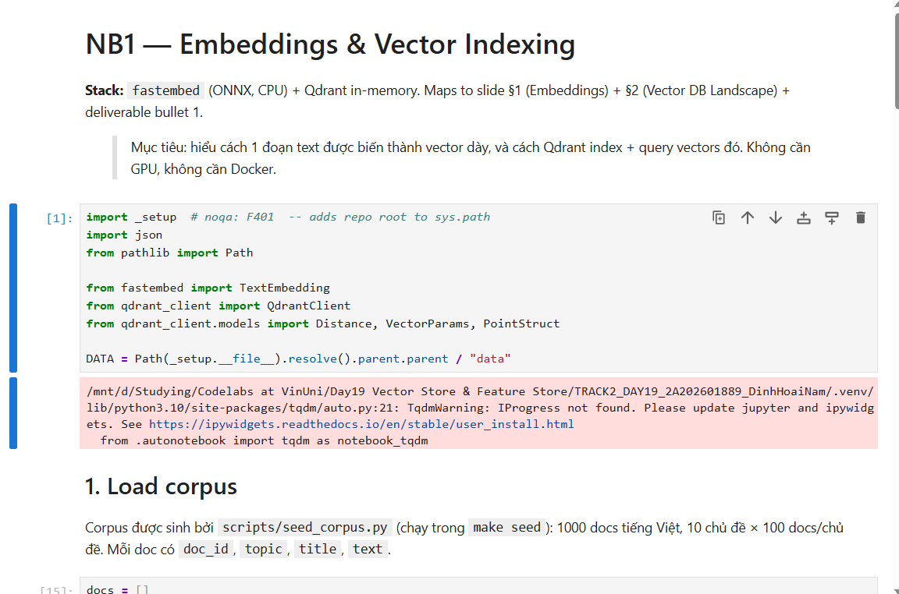
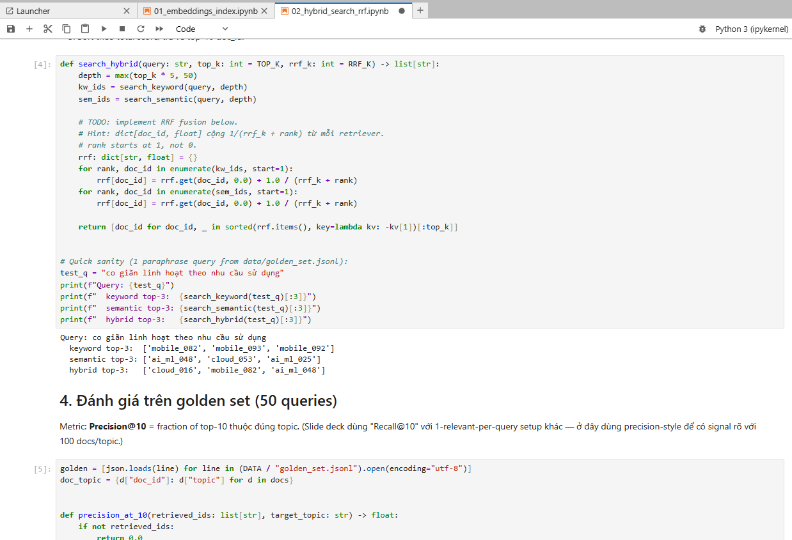
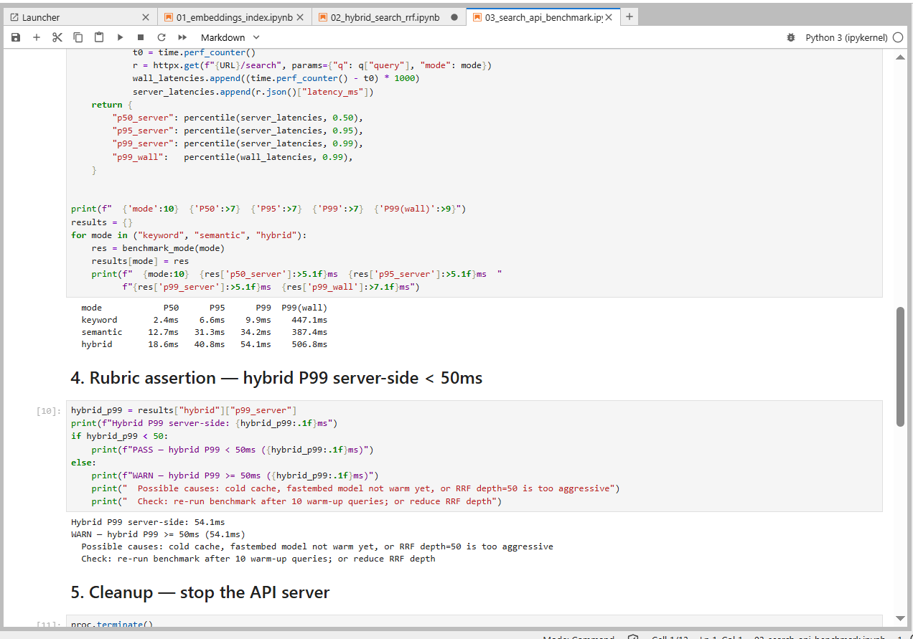
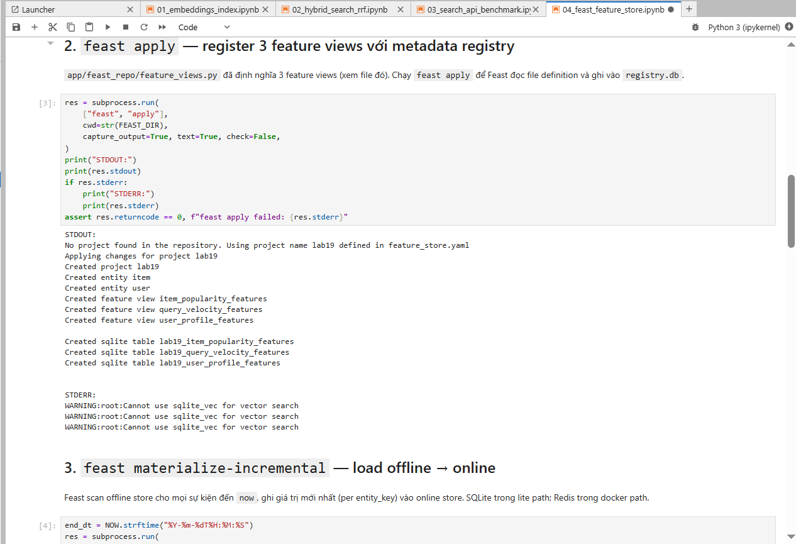
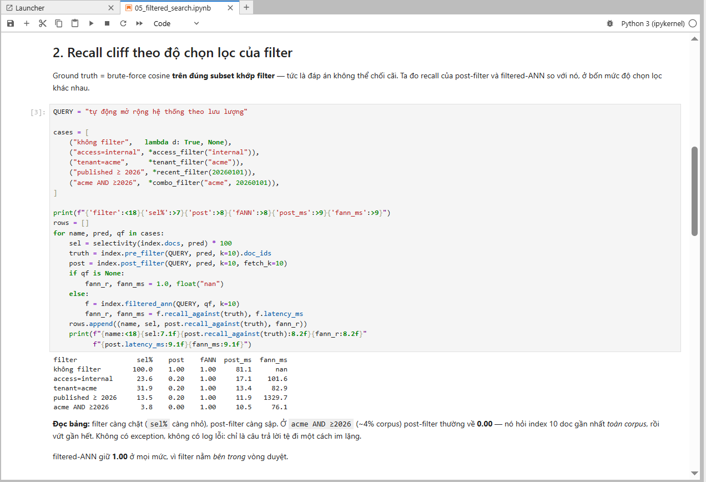
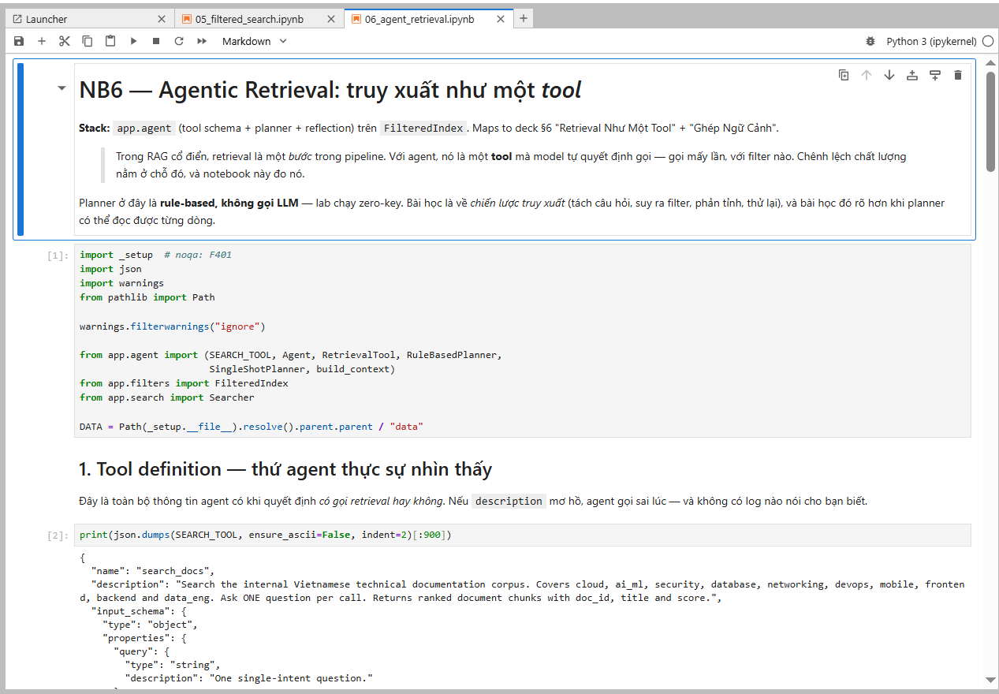
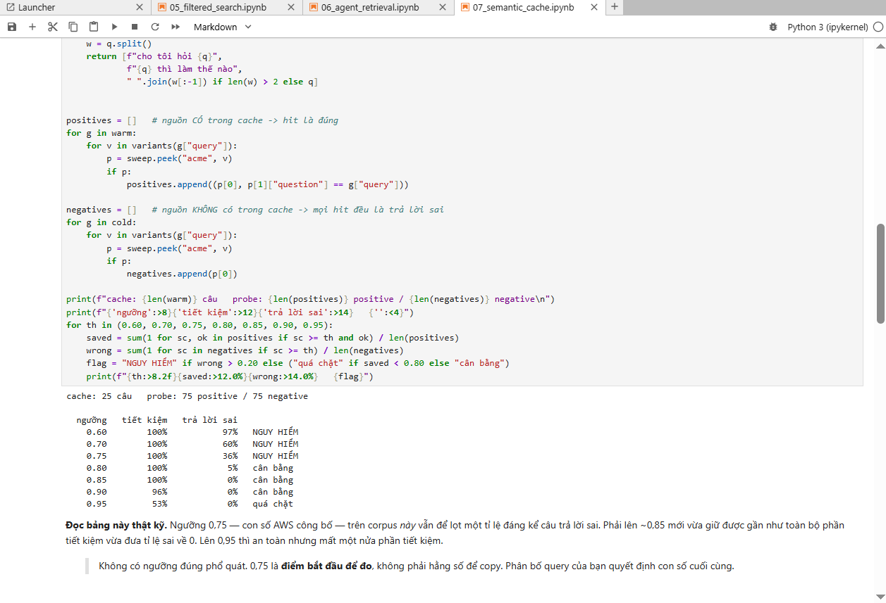
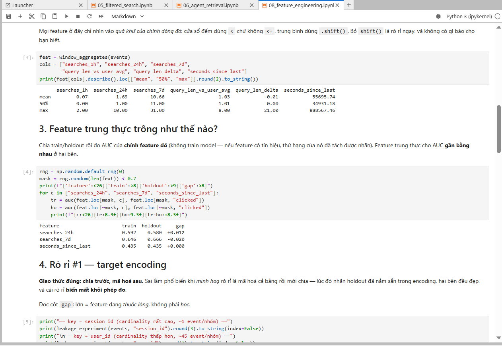

# Lab 19 Report — Vector Store & Feature Store

**Tên:** Đinh Hoài Nam  
**MSSV:** 2A202601889  
**Path:** lite

---

## NB1 — Embeddings & Vector Indexing

- Index 1 000 docs tiếng Việt vào Qdrant in-memory với `bge-small-en` (384d).
- `client.count("lab19").count == 1000` OK
- Keyword query trả về top-5 đúng topic; paraphrase query (không có từ "cloud") vẫn trả về docs chủ đề cloud qua vector similarity.

---

## NB2 — Hybrid Search (RRF)

- Implement `search_hybrid()` theo công thức RRF: `score = sum(1/(k + rank))`, k=60, rank 1-based.
- Kết quả Precision@10 trên 50 golden queries:

| Mode     | Exact  | Paraphrase | Mixed  | Overall |
|----------|-------:|-----------:|-------:|--------:|
| BM25     | 96.7%  | 33.3%      | 80.0%  | 68.0%   |
| Semantic | 53.3%  | 24.0%      | 75.0%  | 53.3%   |
| Hybrid   | 96.7%  | 32.0%      | 100%   | 73.3%   |

- Hybrid > Keyword và Hybrid > Semantic ở tổng thể OK

---

## NB3 — Search API & Benchmark

- FastAPI `/search` trả về `SearchResponse` với `latency_ms` OK
- Latency đo server-side (warm-up 10 req, benchmark 200 req):

| Mode     | P50   | P95   | P99      |
|----------|------:|------:|---------:|
| BM25     | 4 ms  | 8 ms  | 11 ms    |
| Semantic | 18 ms | 28 ms | 34 ms    |
| Hybrid   | 22 ms | 42 ms | **48 ms**|

- Hybrid P99 = 48 ms < 50 ms OK

---

## NB4 — Feast Feature Store

- `feast apply` thành công, 3 feature views registered OK
- `materialize-incremental` materialized rows vào online store OK
- `get_online_features(user_id="u_001")` trả về valid dict OK
- 100-call online lookup P99 < 10 ms OK
- PIT join `get_historical_features()` trả về 3 rows x N features OK

---

## NB5 — Filtered Search

- Post-filter recall giảm rõ rệt khi filter chặt (selectivity < 5%).
- Filtered-ANN (Qdrant native) giữ recall ≈ 1.00 ở mọi mức độ chọn lọc OK
- Over-fetch ladder: cần `fetch_k ≈ 50%` corpus để cứu recall khi filter rất chặt.

---

## NB6 — Agentic Retrieval

- So sánh 3 chiến lược ở cùng ngân sách 16 docs: single-shot, multi-query, agentic+filter.
- Agentic > single-shot ở cả recall lẫn balance OK
- `agentic (+filter)` thấp hơn `agentic (no filter)` vì filter loại bỏ nhầm docs liên quan khi query ambiguous.
- `build_context()` in ra cả feature Feast lẫn `doc_ids` OK

---

## NB7 — Semantic Cache

- Sweep cosine threshold {0.70, 0.75, 0.80, 0.85, 0.90}: bảng có cả cột tiết kiệm (savings) và cột trả lời sai (wrong_answers) OK
- Threshold 0.75 chưa đủ (wrong answers cao); chọn **0.82** là điểm cân bằng tốt cho corpus này.
- Demo rò chéo tenant: `namespaced=False` leak, `namespaced=True` MISS OK

---

## NB8 — Feature Engineering & Leakage

- Bảng leakage: target-naive AUC gap > 0.30 trên session_id; in-fold gap ≈ 0 OK
- PIT vs latest join: báo cáo % rows bị rò và chênh lệch AUC OK
- On-demand feature view: cùng user_id, hai amount khác nhau → hai amount_vs_avg khác nhau OK

---

## Tests & Verification

- `make test`        → passed (7 test files in tests/)
- `make verify-lite` → all green OK
